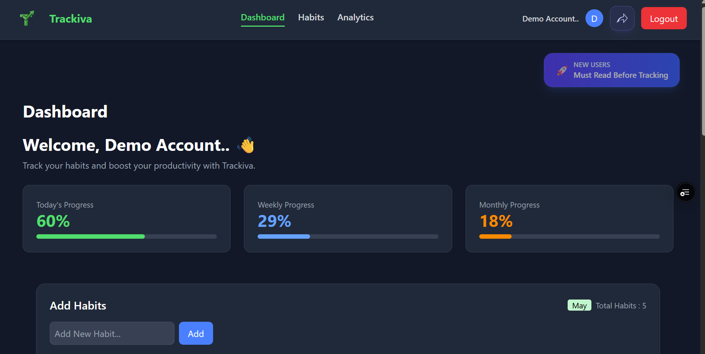
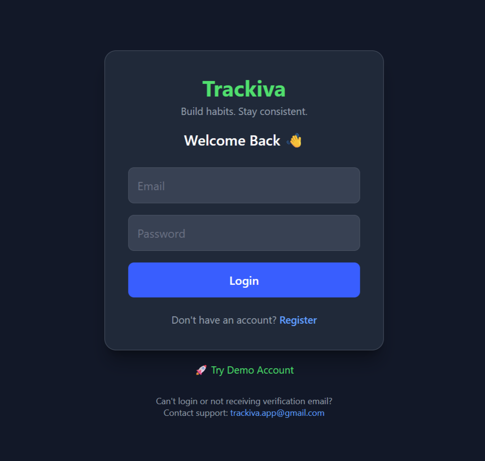

# 🚀 Trackiva – Smart Habit & Productivity Tracking SaaS

Trackiva is a full-stack MERN SaaS application designed to help users build discipline, consistency, and productivity through smart habit tracking and automation.

Users can create and manage daily habits such as:
- Learning new technologies
- Solving DSA problems
- Improving communication skills
- Exercise and fitness goals

Trackiva allows users to mark habits as completed every day. Based on the user's consistency and completed tasks, the application dynamically calculates productivity scores and analytics.

The platform also includes automation features like:
- ⏰ Auto-marking missed habits using cron jobs
- 📧 Smart reminder emails for incomplete habits
- 📊 Productivity analytics and visualization
- 🔐 Secure JWT authentication
- 🌐 Backend uptime monitoring using UptimeRobot

---

# 🌐 Live Demo

🔗 **Frontend (Live App):** https://trackiva-phi.vercel.app/  
🔗 **Backend API:** https://trackiva.onrender.com

> ⚡ Fully deployed and production-ready SaaS application

---

# ✨ Features

## 🔐 Authentication & Security
- User Registration & Login
- JWT Authentication
- Protected Routes
- Secure APIs
- Email-based authentication system

---

## 📋 Habit Management
- Create habits/tasks
- Delete habits
- Track daily progress
- Mark habits as completed or missed
- Daily consistency tracking

---

## 📊 Productivity Analytics
- Daily productivity tracking
- Weekly analytics
- Monthly analytics
- Dynamic productivity calculation
- Heatmap visualization
- Interactive charts using Chart.js

---

## ⏰ Automation Features
- Auto-Miss System at **11:58 PM**
- Automated reminder emails at **8:00 PM**
- Cron job automation using Node-Cron

---

## 📧 Email Reminder System
- Reminder emails for incomplete tasks
- Integrated using **Brevo**
- Helps users maintain consistency

---


## 📱 Responsive SaaS UI
- Fully responsive design
- Modern SaaS dashboard
- Mobile-friendly interface
- Clean UI using Tailwind CSS

---

# 🛠️ Tech Stack

## Frontend
- React.js (Vite)
- Tailwind CSS
- Context API
- Chart.js

---

## Backend
- Node.js
- Express.js
- MongoDB
- Mongoose

---

## Authentication
- JWT (JSON Web Token)

---

## Automation & Services
- Node-Cron
- Brevo Email Service
- UptimeRobot

---

# 📂 Project Structure

```bash
Trackiva/
│
├── backend/
│   ├── config/
│   │   └── db.js
│   │
│   ├── controllers/
│   │   ├── analyticsController.js
│   │   ├── authController.js
│   │   ├── chatController.js
│   │   ├── habitController.js
│   │   └── progressController.js
│   │
│   ├── cron/
│   │   ├── autoMiss.js
│   │   └── reminderEmail.js
│   │
│   ├── middleware/
│   │   └── authMiddleware.js
│   │
│   ├── models/
│   │   ├── Habit.js
│   │   ├── Progress.js
│   │   └── User.js
│   │
│   ├── routes/
│   │   ├── analyticsRoutes.js
│   │   ├── authRoutes.js
│   │   ├── chatRoutes.js
│   │   ├── habitRoutes.js
│   │   └── progressRoutes.js
│   │
│   ├── services/
│   │
│   ├── utils/
│   │   └── sendEmail.js
│   │
│   ├── .env
│   ├── server.js
│   └── package.json
│
├── frontend/
│   ├── public/
│   │   ├── favicon.svg
│   │   ├── icons.svg
│   │   └── logo.png
│   │
│   ├── src/
│   │   ├── api/
│   │   │   ├── analyticsApi.js
│   │   │   ├── habitApi.js
│   │   │   ├── Main_url.js
│   │   │   └── progressApi.js
│   │   │
│   │   ├── assets/
│   │   │   ├── hero.png
│   │   │   └── logo.png
│   │   │
│   │   ├── components/
│   │   │   ├── demoAccount.jsx
│   │   │   ├── Footer.jsx
│   │   │   ├── Heatmap.jsx
│   │   │   ├── Layout.jsx
│   │   │   ├── Navbar.jsx
│   │   │   └── ProtectedRoute.jsx
│   │   │
│   │   ├── context/
│   │   ├── pages/
│   │   ├── App.jsx
│   │   ├── App.css
│   │   ├── index.css
│   │   └── main.jsx
│   │
│   ├── vercel.json
│   ├── vite.config.js
│   └── package.json
│
├── package.json
└── README.md
```

---

# ⚙️ Installation & Setup

## 1️⃣ Clone Repository

```bash
git clone https://github.com/Navath-Lokesh/trackiva
cd trackiva
```

---

# 🔧 Backend Setup

```bash
cd backend
npm install
npm run dev
```

---

# 💻 Frontend Setup

```bash
cd frontend
npm install
npm run dev
```

---

# 🔑 Environment Variables

Create a `.env` file inside backend folder:

```env
PORT=5000

MONGO_URI=your_mongodb_connection_string

JWT_SECRET=your_secret_key

EMAIL_USER=your_email

EMAIL_PASS=your_email_password

CLIENT_URL=http://localhost:5173
```

---

# 📡 API Endpoints

## 🔐 Auth Routes

| Method | Endpoint |
|---|---|
| POST | `/api/auth/register` |
| POST | `/api/auth/login` |

---

## 📋 Habit Routes

| Method | Endpoint |
|---|---|
| GET | `/api/habits` |
| POST | `/api/habits` |
| DELETE | `/api/habits/:id` |

---

## 📊 Analytics Routes

| Method | Endpoint |
|---|---|
| GET | `/api/analytics/dashboard` |

---

## ✅ Progress Routes

| Method | Endpoint |
|---|---|
| POST | `/api/progress` |
| GET | `/api/progress` |

---

# 📸 Screenshots

## 🖥️ Dashboard



---

## 🔐 Login Page



---

## 🧠 Trackiva Logo


# 🚀 Future Improvements

- 📱 Mobile Application
- 🔔 Push Notifications
- 👥 Team Habit Tracking
- 📅 Calendar Integrations

---

# 👨‍💻 Author

## Lokesh Navath

- GitHub: https://github.com/Navath-Lokesh
- LinkedIn: https://www.linkedin.com/in/navath-lokesh-9b8976318/
- Email: lokeshnavath@gmail.com

---

# 📄 License

This project is licensed under the **MIT License**.

---

# ⭐ Support

If you like this project, give it a ⭐ on GitHub and support the project.

---

> Built with ❤️ using the MERN Stack and modern SaaS architecture.